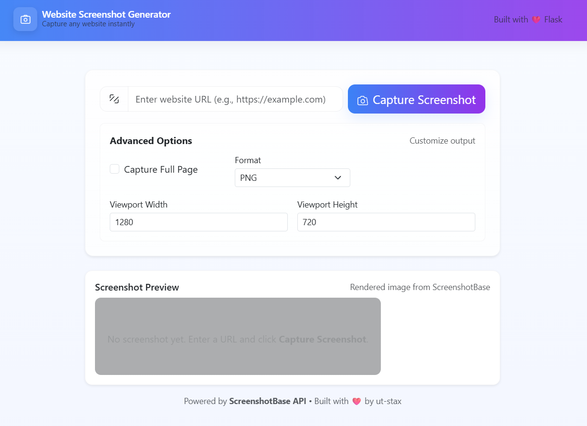

# 📸 Website Screenshot Generator

A Flask-based web application that captures screenshots of websites using the ScreenshotBase API. Built with modern UI components and responsive design. 🚀

## 🌐 Live Demo

Try the live version: [https://screenshot-generator-production.up.railway.app/](https://screenshot-generator-production.up.railway.app/)

## 🖼️ Screenshot



## ✨ Features

- **🔗 Easy URL Input**: Enter any website URL to capture its screenshot
- **⚙️ Advanced Options**:
  - 📄 Full page capture
  - 🖼️ Multiple formats (PNG, JPG, GIF, WEBP)
  - 📐 Customizable viewport dimensions
- **👀 Instant Preview**: View captured screenshots directly in the browser
- **⬇️ Download & Share**: Download images or open them in new tabs
- **📱 Responsive Design**: Works seamlessly on desktop and mobile devices
- **🛡️ Error Handling**: User-friendly error messages for invalid URLs or API issues

## 📋 Prerequisites

- 🐍 Python 3.8 or higher
- 🔑 ScreenshotBase API key (get one at [ScreenshotBase](https://screenshotbase.com))

## 🛠️ Installation

1. 📥 Clone the repository:
   ```bash
   git clone <repository-url>
   cd screenshot-generator
   ```

2. 🏗️ Create a virtual environment:
   ```bash
   python -m venv venv
   source venv/bin/activate  # On Windows: venv\Scripts\activate
   ```

3. 📦 Install dependencies:
   ```bash
   pip install -r requirements.txt
   ```

4. 🔐 Set up environment variables:
   - Create a `.env` file in the root directory
   - Add your ScreenshotBase API key:
     ```
     SCREENSHOTBASE_API_KEY=your_api_key_here
     ```

## 🚀 Usage

1. ▶️ Start the application:
   ```bash
   python app.py
   ```

2. 🌍 Open your browser and navigate to `http://localhost:5000`

3. 🔗 Enter a website URL and click "Capture Screenshot"

4. ⚙️ Customize options as needed (full page, format, viewport size)

5. 👀 View the preview, download, or retake the screenshot

## 📁 Project Structure

```
screenshot-generator/
├── app.py                 # 🖥️ Main Flask application
├── requirements.txt       # 📦 Python dependencies
├── .env                   # 🔐 Environment variables (API key)
├── static/
│   ├── style.css         # 🎨 Custom CSS styles
│   ├── script.js         # 💻 Frontend JavaScript
│   ├── image.png         # 🖼️ Favicon
│   └── screenshots/      # 📸 Generated screenshot storage
└── templates/
    └── index.html        # 📄 Main HTML template
```

## 🔗 API Integration

This application uses the ScreenshotBase API for screenshot generation. The API provides:
- 🖼️ High-quality screenshots
- 🎭 Multiple output formats
- 📏 Custom viewport sizes
- 📜 Full page capture capability

## 🤝 Contributing

1. 🍴 Fork the repository
2. 🌿 Create a feature branch
3. 🔧 Make your changes
4. ✅ Test thoroughly
5. 📤 Submit a pull request

## 📄 License

This project is open source and available under the [MIT License](LICENSE).

## 🛠️ Built With

- **Flask**: 🖥️ Python web framework
- **Bootstrap 5**: 🎨 Responsive CSS framework
- **Lucide Icons**: 🎭 Modern icon library
- **ScreenshotBase API**: 📸 Screenshot generation service
